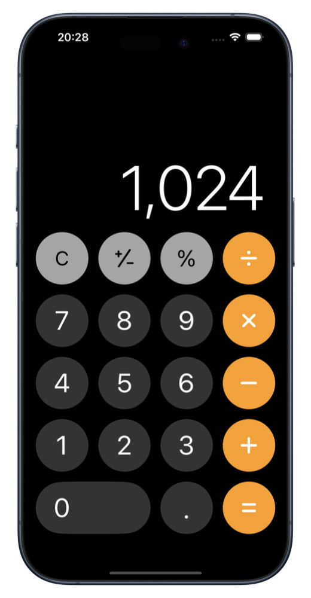
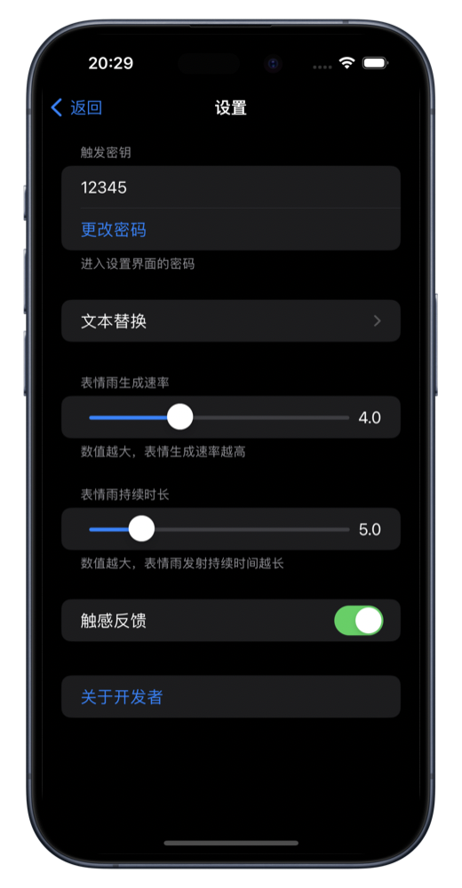
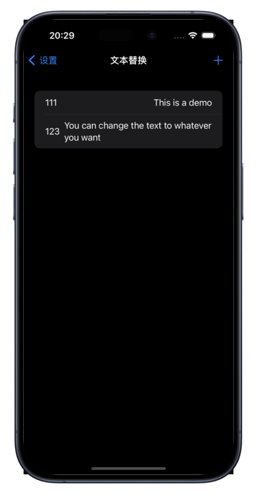

# SwiftUI 计算器
> 用 swiftUI 仿写一个 iOS 原生计算器

效果图如下

使用指南见：[SwiftUI 计算器使用指南](https://jo-cruise.github.io/posts/SwiftUICalculatorIntroduction/)

# SwiftUICalculator

> Use SwiftUI to imitate iOS calculator

The effect diagram is as follows

For usage guide, see: [SwiftUI Calculator Usage Guide](https://jo-cruise.github.io/posts/SwiftUICalculatorIntroduction/)