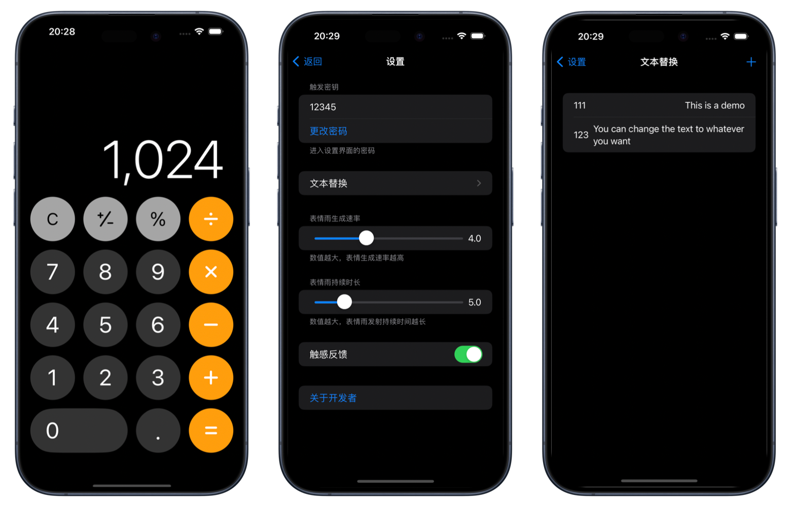

# SwiftUICalculator

> This is a calculator app built with SwiftUI, designed to replicate the core functionalities of the native iOS calculator while adding some unique and interesting new features. For both beginners and experienced SwiftUI developers, it serves as an excellent project for learning and practice.

## ✨ Features

- **Complete Calculator Functions**:
    - Supports addition, subtraction, multiplication, and division, following the order of operations.
    - Supports percentage calculations and switching between positive/negative signs.
    - Supports continuous calculations for seamless operations.
    - Supports swiping left/right to delete the last entered digit.
- **Convenient Interactions**:
    - Haptic Feedback: Provides haptic feedback for button clicks, which can be enabled or disabled in the settings.
    - Quick Copy: Use Haptic Touch on the main screen to quickly copy the last calculation result to the clipboard.
- **Innovative Text Replacement**:
    - Activated via a "wake-up keyword + long press" gesture.
    - Customize trigger codes and replacement phrases in the settings.
    - Emoji Rain: Triggers a fun Emoji Rain effect when the replacement phrase contains specific emojis! The duration and frequency can be adjusted in the settings.
- **Multi-language Support**:
    - Supports both Chinese and English.
 
The effect diagram is as follows

For usage guide, see: [SwiftUI Calculator Usage Guide](https://jo-cruise.github.io/posts/SwiftUICalculatorIntroduction/)
